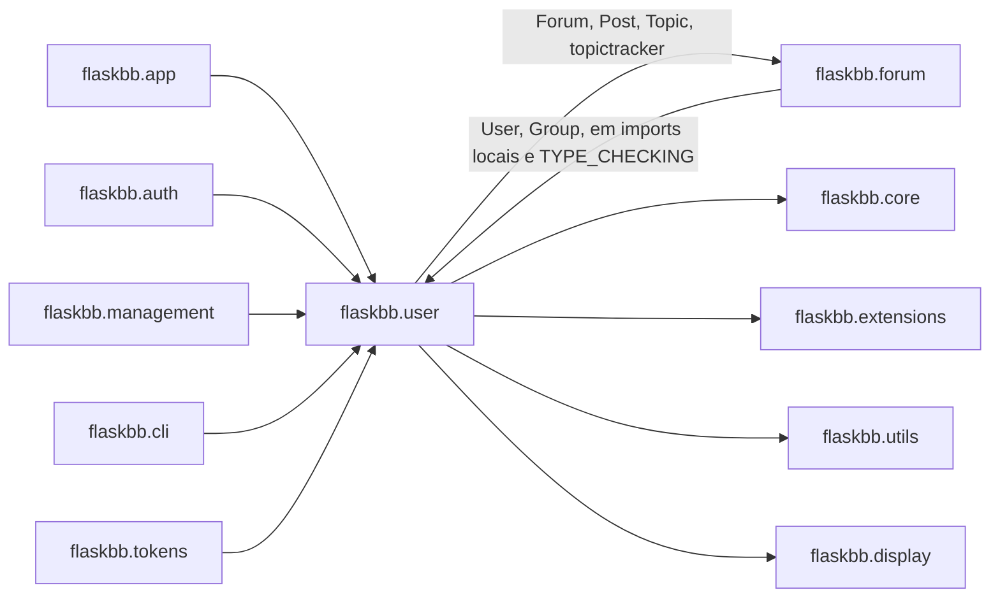

# Parte 3, Tarefa 3.2, Análise como Sistema Legado

**Autor:** João Ricardo Magalhães Oliveira

**Módulo analisado:** `flaskbb/user`

## 1. Dependências internas e externas

Rodando `grep` sobre o código real do fork, mapeei quem `flaskbb/user`
importa e quem importa `flaskbb/user`.

A parte mais importante desse diagrama é o par `user` ⇄ `forum`, existe uma
dependência **circular** de verdade entre os dois. `flaskbb/user/models.py`
importa `Forum`, `Post`, `Topic` e `topictracker` de `flaskbb/forum/models.py`
direto no topo do arquivo (linha 31), para calcular contagem de posts e
tópicos do usuário. Ao mesmo tempo, `flaskbb/forum/models.py` importa `User`
e `Group` de `flaskbb/user/models.py` em pelo menos 7 lugares diferentes,
mas quase todos **dentro do corpo de funções**, não no topo do arquivo (por
exemplo, nas linhas 675, 966, 1042, 1319, 1494, 1540 e 1608), e mais um uso
dentro de um bloco `if TYPE_CHECKING:` (linha 36), que só existe para
checagem de tipos e não roda de verdade.

Isso não é um estilo de código escolhido por acaso, é um jeito de contornar
um `ImportError` de importação circular, se `forum/models.py` importasse
`user/models.py` no topo do arquivo, e vice-versa, o Python não conseguiria
carregar nenhum dos dois módulos primeiro. Adiar a importação para dentro
da função resolve o problema na hora de rodar, mas esconde o fato de que os
dois módulos, na prática, formam uma unidade só, e não dois módulos
realmente independentes.

## 2. Acoplamento e coesão

### Alto acoplamento 1, `user` e `forum`

Já descrito na seção 1. O acoplamento é bidirecional e estrutural, não dá
para entender `User.all_topics`/`all_posts` sem conhecer os modelos de
`forum`, e não dá para entender boa parte de `forum/models.py` sem
conhecer `User` e `Group`. Separar os dois módulos de verdade, hoje, exigiria
mudar as duas pontas ao mesmo tempo.

### Alto acoplamento 2, `services/factories.py` e os singletons globais

`flaskbb/user/services/factories.py` importa `db` e `pluggy` direto de
`flaskbb.extensions` (linha 18) e usa esses dois objetos globais dentro de
cada função fábrica, sem receber nenhum dos dois como parâmetro. Isso
acopla toda a camada de serviços a essas duas instâncias específicas.
A prova prática disso apareceu na própria Parte 2 deste projeto,
`tests/unit/user/test_password_update_handler_mock.py` precisou fazer
`mocker.patch("flaskbb.user.services.factories.pluggy", ...)`, isto é,
substituir um atributo de módulo na marra, porque não existe nenhum jeito
de passar um `pluggy` falso de fora para dentro da função.

### Baixa coesão, `flaskbb/user/models.py`

Este único arquivo reúne três responsabilidades bem diferentes, o modelo
`Group` (papéis e permissões), o modelo `User` (conta, autenticação,
detalhes de perfil, e ainda consultas de paginação de tópicos e posts do
fórum) e o modelo `Guest` (usuário anônimo, reimplementando a mesma lógica
de permissões do `User`). O catálogo de code smells da Parte 2 já mostrou
um sintoma direto dessa baixa coesão, o método `get_permissions` estava
duplicado, palavra por palavra, entre `User` e `Guest`, porque as duas
classes vivem no mesmo arquivo mas não compartilham uma base comum de
verdade.

## 3. Pontos de fragilidade

1. **`User._update_secondary_groups`** (chamado por `save`, em `models.py`).
   Remove todos os grupos secundários do usuário e adiciona de volta só os
   informados, ao invés de calcular a diferença. Isso é uma operação cara
   de banco, e, como vimos na Parte 2, não existe nenhum teste que chame
   `save(groups=...)` diretamente. Mexer aqui sem cuidado pode mudar o
   comportamento de gerenciamento de grupos sem que a suíte perceba.

2. **A dependência circular `user` ⇄ `forum`**, descrita nas seções 1 e 2.
   Qualquer reorganização de pastas, ou tentativa de "limpar" os imports
   que estão dentro de funções em `forum/models.py`, sem entender por que
   eles estão lá, pode reintroduzir um `ImportError` na inicialização do
   FlaskBB inteiro, não só do módulo `user`.

3. **`ValidateAvatarURL.validate`** (`services/validators.py`). Faz uma
   requisição HTTP de verdade, para a URL de avatar informada pelo usuário,
   durante a validação do formulário. O comportamento da validação passa a
   depender da disponibilidade da rede e do conteúdo remoto naquele
   instante exato, e a própria docstring já existente no código admite que,
   se a imagem mudar depois, a checagem não é refeita. É um caminho crítico
   de validação apoiado em uma chamada de rede síncrona e potencialmente
   lenta ou instável.

## 4. Aplicação da Lei de Lehman

A lei que mais aparece com evidência concreta neste módulo é a de
**Complexidade Crescente** (a complexidade de um sistema aumenta com o
tempo, a menos que se trabalhe ativamente para reduzi-la). A dependência
circular entre `user` e `forum` foi resolvida com um remendo estrutural,
imports adiados para dentro de funções, e não com uma separação real de
responsabilidades. O próprio catálogo de smells da Parte 2 encontrou código
duplicado (`get_permissions`, `ban`/`unban`) que só existe porque, em algum
momento, alguém copiou um método ao invés de reaproveitar o que já existia.
E o comentário `TODO: Only remove/add groups that are selected`, que
encontramos e só documentamos na Parte 2 (não corrigimos, para não mudar
comportamento), é mais uma peça dessa mesma história, uma limitação
conhecida há tempo suficiente para virar comentário, mas nunca resolvida.
Nenhuma dessas coisas aconteceu de uma vez só, são acréscimos pequenos,
um de cada vez, que se acumularam sem uma reestruturação de fundo.

## 5. Seams identificáveis

1. **`services/factories.py`**, nas funções `password_update_handler`,
   `email_update_handler`, `details_update_factory` e
   `settings_update_handler`. Hoje elas leem `db` e `pluggy` direto do
   módulo `flaskbb.extensions`. Um seam natural seria aceitar esses dois
   objetos como parâmetro, com o valor atual como padrão, por exemplo
   `def password_update_handler(db=db, plugin_manager=pluggy):`. Isso
   permitiria substituir o `pluggy` por um objeto de teste passando um
   argumento, ao invés de precisar de `mocker.patch` em um atributo de
   módulo, como a Parte 2 precisou fazer.

2. **`ValidateAvatarURL.validate`**, em `services/validators.py`. A função
   `check_image`, que faz a chamada de rede, está importada e chamada
   direto dentro do método. Um seam natural seria receber essa função como
   um atributo da própria classe, com `check_image` como padrão, por
   exemplo `check_image_fn = attr.ib(default=check_image)`. Isso deixaria a
   troca por uma versão falsa, sem rede, tão simples quanto instanciar a
   classe com outro valor, ao invés de precisar mockar a biblioteca
   `responses` para simular uma resposta HTTP inteira, como o teste
   `test_update_validator.py::TestValidateAvatarURL` já precisa fazer hoje.
