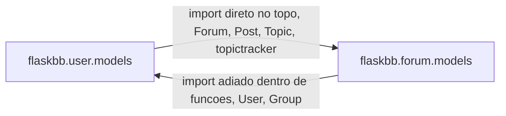
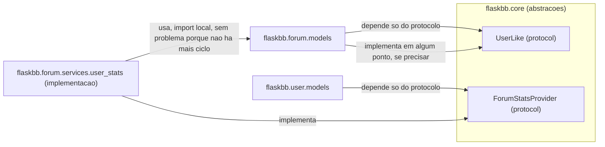

# Parte 3, Tarefa 3.3, Proposta de Evolução

**Autor:** João Ricardo Magalhães Oliveira

**Módulo analisado:** `flaskbb/user`

**Proposta escolhida:** Extrair `forum` como dependência invertida de `user`,
quebrando a dependência circular `user` ⇄ `forum`.

## 1. Motivação

Essa proposta parte direto dos dois achados mais fortes das Tarefas 3.1 e
3.2. A `MODULO.md` já mostrava que `flaskbb/user` faz uma requisição de
saída (o `check_image`) e dispara hooks de pós atualização, mas o ponto mais
delicado, descrito com detalhe na `ANALISE_LEGADO.md`, é a dependência
circular real entre `flaskbb/user` e `flaskbb/forum`, `user/models.py`
importa `Forum`, `Post`, `Topic` e `topictracker` direto no topo do arquivo
(linha 31), enquanto `forum/models.py` importa `User` e `Group` de volta em
pelo menos 7 lugares, quase todos escondidos dentro do corpo de funções só
para fugir de um `ImportError` na inicialização.

A própria análise já aplicou a Lei de Lehman de Complexidade Crescente
sobre esse ponto, o remendo dos imports adiados resolve o problema na hora
de rodar, mas esconde o fato de que os dois módulos, hoje, formam uma
unidade só. Rodar essa proposta é a continuação natural desse raciocínio,
ao invés de só documentar o problema, ela desenha um caminho concreto para
resolvê lo sem reescrever o sistema inteiro de uma vez.

## 2. Estado atual (revisão rápida)

Os dois módulos se conhecem diretamente, e o Python só consegue carregar os
dois porque um dos dois lados adia a importação para dentro de função.

## 3. Estado alvo

A ideia central é a **inversão de dependência**, nenhum dos dois módulos
importa o outro diretamente mais. Os dois passam a depender só de um
protocolo definido em `flaskbb/core`, que já existe hoje como pasta e já
guarda abstrações parecidas (`flaskbb/core/changesets.py`,
`flaskbb/core/user/update.py`). Quem implementa o protocolo, e portanto quem
precisa importar os dois lados de verdade, é uma camada de serviço nova,
isolada, que pode importar os dois sem criar ciclo, porque nem `user` nem
`forum` dependem dela de volta.

Concretamente, os pontos que hoje moram em `User` e leem de `forum`
(`all_topics`, `all_posts`, `posts_per_day`, `topics_per_day`, que hoje
consultam `Topic`/`Post` direto dentro de `models.py`) deixam de fazer a
consulta ali dentro. Em vez disso, `User` passa a chamar um objeto
`ForumStatsProvider`, injetado ou resolvido por um registro simples, e quem
implementa esse objeto, com as consultas reais de `Post`/`Topic`, é um
código que vive do lado de `forum`, não de `user`.

## 4. Plano de migração incremental

1. **Criar o protocolo `ForumStatsProvider` em `flaskbb/core`.** Só a
   assinatura dos métodos que `User` precisa hoje, contagem de posts,
   contagem de tópicos, médias por dia. Nenhum código de consulta ainda,
   só a interface. Esse passo não muda nenhum comportamento, então os
   243 testes que já existem continuam passando sem tocar em nada.

2. **Implementar `DefaultForumStatsProvider` do lado de `flaskbb/forum`**,
   copiando as consultas que hoje estão em `User.all_topics`,
   `User.all_posts`, `posts_per_day` e `topics_per_day`, só que recebendo o
   `user_id` como parâmetro, ao invés de serem métodos de instância de
   `User`. Nesse passo o código antigo em `models.py` continua existindo,
   o novo só é adicionado ao lado, então dá para rodar os dois e comparar
   resultado, sem nenhum risco de quebrar produção.

3. **Trocar as chamadas dentro de `User`** para delegar ao provider novo
   ao invés da consulta direta, mas mantendo o import de `Forum`/`Post`/
   `Topic` como estava, só comentado com um aviso de depreciação. Esse é o
   ponto onde os testes existentes validam que o resultado é idêntico ao
   antigo, antes de remover qualquer coisa.

4. **Remover o import direto de `forum` em `user/models.py`.** Só depois
   que o passo 3 já provou, com os testes rodando, que ninguém mais chama o
   caminho antigo. Esse é o passo que efetivamente quebra a metade
   `user → forum` do ciclo.

5. **Revisar os 7 pontos de import adiado em `forum/models.py`** um por
   um, e decidir, caso a caso, se cada um pode ser substituído por uma
   dependência do protocolo `UserLike` (para os casos que só precisam
   verificar permissão ou pegar o id do usuário) ou se realmente precisa
   do modelo `User` completo (para os casos que fazem `join` direto no
   banco). Só os casos do primeiro tipo entram nesta fase.

6. **Rodar a suíte completa em modo serial (`uv run pytest -n 0`)** depois
   de cada um dos passos acima, comparando o número de "Miss" da cobertura
   com o valor que já documentamos na Parte 2 (193 em `models.py`, 377 no
   módulo inteiro), do mesmo jeito que fizemos na `VALIDACAO.md`, para
   garantir que a migração não perdeu cobertura de verdade em nenhum
   passo.

7. **Documentar o novo diagrama de dependências**, atualizando o desenho
   da `ANALISE_LEGADO.md` para refletir o estado depois da migração, como
   fechamento do trabalho.

## 5. Riscos e mitigações

| Risco | Mitigação |
|---|---|
| A consulta nova (`DefaultForumStatsProvider`) calcular um resultado diferente da antiga, por exemplo um `JOIN` que hoje é implícito no relacionamento do SQLAlchemy e vira explícito na consulta nova. | Rodar os dois caminhos em paralelo no passo 3 antes de remover o antigo, e comparar o resultado nos testes existentes antes de apagar qualquer linha. |
| Algum dos 7 pontos de import adiado em `forum/models.py` precisar mesmo do modelo `User` completo, e a tentativa de trocar por `UserLike` quebrar em produção sem nenhum teste avisando, porque, como a `ANALISE_LEGADO.md` já registrou, `_update_secondary_groups` e outros pontos ligados a grupo não têm teste direto hoje. | Tratar o passo 5 caso a caso, não em lote, e escrever um teste novo cobrindo o comportamento antes de trocar cada ponto, não depois. |
| A migração ficar pela metade, com o protocolo criado mas só parte do código migrado, o que aumentaria a complexidade ao invés de reduzir (mais um jeito de fazer a mesma coisa, ao invés de um jeito só). | Cada passo do plano é pequeno o suficiente para virar um commit fechado e revisável sozinho, e o passo 4 (remover o import antigo) só acontece depois que o passo 3 já provou, com teste rodando, que o caminho novo funciona. Não faz sentido parar entre o passo 3 e o 4 por muito tempo. |

## 6. Fora de escopo

- Mudar a modelagem do banco de dados, tabelas, colunas ou relacionamentos
  do SQLAlchemy. A proposta é só sobre a organização do código Python, não
  sobre o schema.
- Resolver a segunda dependência circular parcial que aparece nos outros
  4 pontos de `forum/models.py` que realmente precisam do modelo `User`
  completo (join direto), esses continuam com import local por enquanto,
  como já estão hoje, e ficam documentados como trabalho futuro.
- Trocar `pluggy` ou o sistema de hooks por outra coisa, essa proposta não
  mexe em nada relacionado a extensão de plugins, só na relação direta
  entre os dois módulos de modelo.
- Aplicar o mesmo padrão em outros pares de módulos do FlaskBB que possam
  ter problema parecido, por exemplo `management` ou `auth`. O escopo
  deste trabalho, como definido desde a Parte 1, é só `flaskbb/user`.
